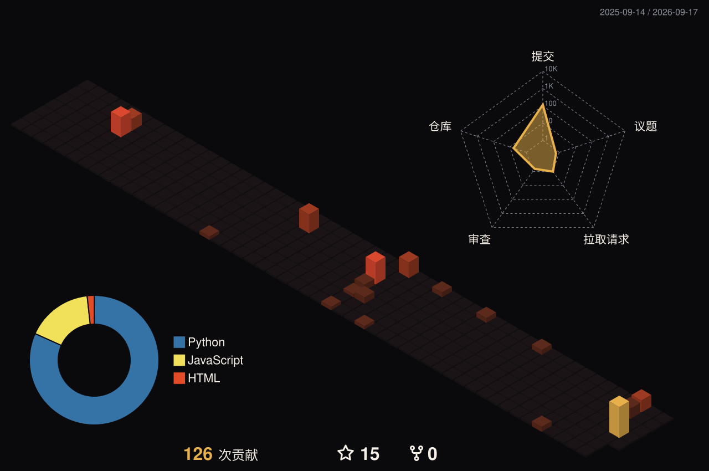

<!--
  ✨ 这张名片会自动生长
  ── 贪吃蛇 / 统计卡片 / 3D 贡献图 由 .github/workflows/profile-assets.yml 每天自动刷新
  ── 终端卡片与流光分隔线由 tools/make_terminal_svg.py 生成
-->

 

## 🧊 关于我

<table width="100%">
<tr>
<td width="58%" valign="top">
  
</td>
<td width="42%" valign="top">
  <b>陆逸昊 · taboo-hacker</b>
  
<i>「再次相遇 你我皆是路人」</i>

  <ul>
    <li>🔭 <b>衢州职业技术学院</b> · 人工智能技术应用</li>
    <li>🧠 专注 AI 应用开发，用代码解决身边真实的痛点</li>
    <li>⚙️ 从 Web、桌面到浏览器扩展，喜欢把想法做成能跑起来的东西</li>
    <li>🧩 项目哲学：AI 不是替代思考，而是放大创造</li>
    <li>🎯 现在：把 Agentic Coding 用进日常开发 —— 代码审查 / 重构 / 自动化</li>
    <li>🛠️ 顺带自建了一套 Forgejo + Docker + Cloudflare Tunnel 的私有基建</li>
  </ul>
</td>
</tr>
</table>

## 📊 GitHub 数据

  
  

  

## GitHub 贡献图

  <picture>
    <source media="(prefers-color-scheme: dark)" srcset="./assets/snake.svg" />
    <source media="(prefers-color-scheme: light)" srcset="./assets/snake-light.svg" />
    
  </picture>
  

## 🛠️ 技术栈

<b>主语言 / 运行时</b>

<b>前端</b>

<b>后端 / 服务端</b>

<b>AI &amp; LLM</b>

<b>展开看完整技术栈</b>（桌面端 · 视觉模型 · 数据库 · DevOps · 工具链）

 

<b>桌面端</b>

<b>AI / ML 模型 &amp; 视觉</b>

<b>数据库 &amp; 缓存</b>

<b>DevOps &amp; 可观测性</b>

<b>工具链 &amp; 代码质量</b>

## 🚀 精选项目

<table width="100%">
<tr>
<td width="50%" valign="top">
  <h3>🌐 main-side · 个人主站</h3>
  
博客 · 番剧库 · 游戏中心 · 在线 IDE 的一站式全栈平台。 
  Vue 3 + Express + MySQL + Redis + Docker 全栈部署，设计语言 v4.0「宣纸墨韵」，一键部署 CLI 双模式切换，Prometheus / Grafana / Loki / Jaeger 全链路可观测，bcrypt + JWT 黑名单 + 请求签名防重放。

  

    
    
  

</td>
<td width="50%" valign="top">
  <h3>🖥️ <a href="https://github.com/taboo-hacker/qzct-login">qzct-login</a></h3>
  
专为衢职院定制的校园网登录助手，告别每次手动登录的痛点。 
  PySide6 桌面应用、多线程并发、299 个测试用例、代码签名发布；用 DeepSeek Harness 接入 AI 智能体做代码审查与重构。

  

    
    
    
  

</td>
</tr>
<tr>
<td width="50%" valign="top">
  <h3>🌙 <a href="https://github.com/taboo-hacker/simple-dark-mode-reader">simple-dark-mode-reader</a></h3>
  
轻量高效的网页增强浏览器扩展：智能深色模式、页面净化、权限保护、视频增强、反跟踪；所有设置自动持久化，刷新与站内跳转后依然生效。

  

    
    
    
  

</td>
<td width="50%" valign="top">
  <h3>📖 <a href="https://github.com/taboo-hacker/novel-reader">novel-reader</a></h3>
  
基于 Python 标准库的本地小说阅读器 Web 应用，零额外依赖。自动解析 ZIP 中的飞卢小说文本，智能分章，响应式阅读界面适配多种设备。

  

    
    
    
  

</td>
</tr>
<tr>
<td width="50%" valign="top">
  <h3>🧮 <a href="https://github.com/taboo-hacker/endfield-material-calculator">endfield-material-calculator</a></h3>
  
《明日方舟：终末地》材料计算器。纯前端实现，HTML5 + Tailwind CSS + Chart.js，响应式界面，算材料不用再开表格。

  

    
    
  

</td>
<td width="50%" valign="top">
  <h3>🐱 <a href="https://github.com/taboo-hacker/task2">task2</a></h3>
  
基于 PyTorch 的猫狗图像分类项目（课本实践）。从数据增强、迁移学习到训练曲线可视化，是我深度学习入门的第一块垫脚石。

  

    
    
  

</td>
</tr>
</table>

## 📫 联系我

<table>
<tr>
<td>
  
</td>
<td>
  
</td>
</tr>
<tr>
<td>
  
</td>
<td>
  
</td>
</tr>
</table>

> 欢迎在我的任意仓库提 Issue 交流，也欢迎来我的自建 Git 服务逛逛。

「再次相遇 你我皆是路人」· 但代码会记得每一次提交 
README 由 GitHub Actions 每日自动刷新 · Built with ❤️ + DeepSeek Harness

